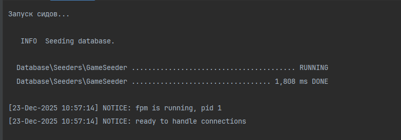
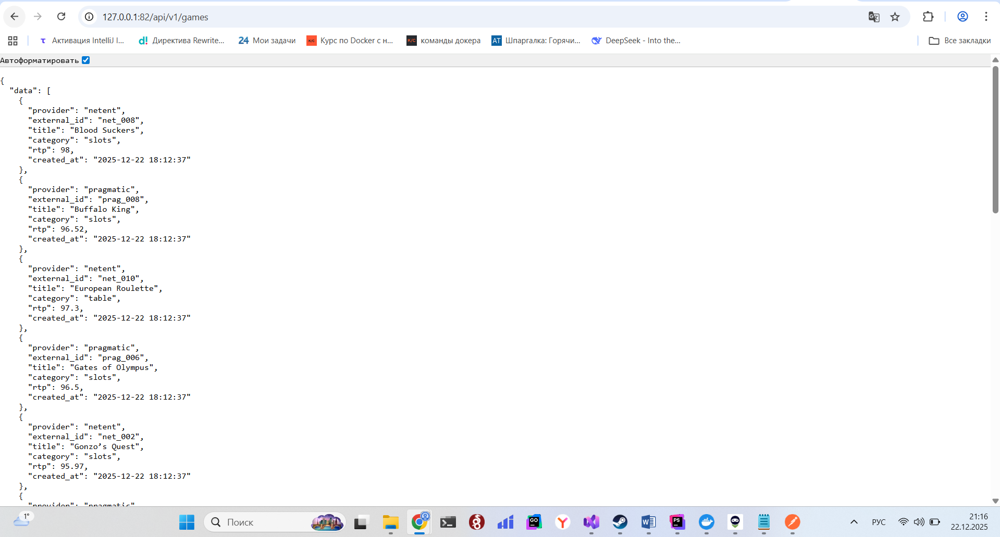

# 1 Выполнить в терминале 
docker compose up -d
# 2 Подождать пару минут, должны установиться все зависимости и сиды после поднятия образа
проверить можно с помощщью команды
docker logs -f php-fpm-test

как появится надпись:
[23-Dec-2025 10:57:14] NOTICE: fpm is running, pid 1
[23-Dec-2025 10:57:14] NOTICE: ready to handle connections
значит можно использовать апи
http://127.0.0.1:82/api/v1/games

Импорт игр от провайдера
curl -X POST http://127.0.0.1:82/api/v1/providers/netent/games/import \
-H "Content-Type: application/json" \
-d '[
{"id":"book_of_dead","title":"Book of Dead","category":"slots","active":true,"rtp":96.5},
{"id":"european_roulette","title":"European Roulette","category":"table","active":true},
{"id":"mega_joker","title":"Mega Joker","category":"slots","active":false,"rtp":99.0}
]'

Получение публичного каталога с параметрами 
# Фильтр по провайдеру
curl "http://127.0.0.1:82/api/v1/games?provider=netent"

# Фильтр по категории
curl "http://127.0.0.1:82/api/v1/games?category=slots"

# Фильтр по провайдеру и категории
curl "http://127.0.0.1:82/api/v1/games?provider=netent&category=slots"

# Сортировка по названию (по убыванию)
curl "http://127.0.0.1:82/api/v1/games?sort=title&order=desc"

# Пагинация (вторая страница, 10 записей)
curl "http://127.0.0.1:82/api/v1/games?page=2&per_page=10"

Некорректная категория
curl -X POST http://127.0.0.1:82/api/v1/providers/netent/games/import \
-H "Content-Type: application/json" \
-d '[{"id":"test","title":"Test Game","category":"wrong_category","active":true}]'

Дубликаты в одном запросе:
curl -X POST http://127.0.0.1:82/api/v1/providers/netent/games/import \
-H "Content-Type: application/json" \
-d '[
{"id":"same_id","title":"Game 1","category":"slots","active":true},
{"id":"same_id","title":"Game 2","category":"slots","active":true}
]'
